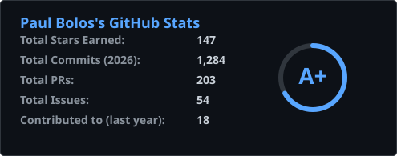
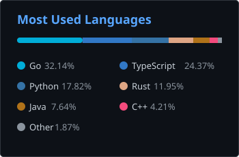

# Paul Bolos

**Senior Backend Engineer & DevOps Specialist**

Designing and shipping production systems at scale. 6+ years building high-throughput APIs, distributed services, and cloud-native infrastructure. Passionate about clean architecture, observability, and developer tooling.

---

### What I do

- Architect and build backend services handling millions of requests daily using **Node.js**, **Go**, and **Python**
- Design and maintain CI/CD pipelines, container orchestration, and infrastructure-as-code with **Docker**, **Kubernetes**, and **GitHub Actions**
- Build and optimize relational and document databases — **PostgreSQL**, **MongoDB**, **Redis**
- Manage production infrastructure on **Linux** servers with **Nginx**, **Cloudflare**, and automated deployment strategies
- Mentor junior developers and lead code reviews across cross-functional teams

---

### Core Stack

**Languages**

**Backend & APIs**

**Infrastructure & DevOps**

**Data**

**Frontend** *(when needed)*

---

### Highlights

- Built and maintained a real-time event processing pipeline serving **2M+ events/day** (Go, Kafka, PostgreSQL)
- Led migration of monolithic Node.js API to microservices architecture — reduced p95 latency by 60%
- Designed multi-region deployment strategy with zero-downtime releases across 3 cloud providers
- Open-source contributor to several backend tooling and observability projects
- Speaker at local meetups on distributed systems and DevOps best practices

> Most of my work lives in private enterprise repositories.

---

### GitHub

  
  

---

bolospaul7@gmail.com &middot; Discord: @qPaul7
